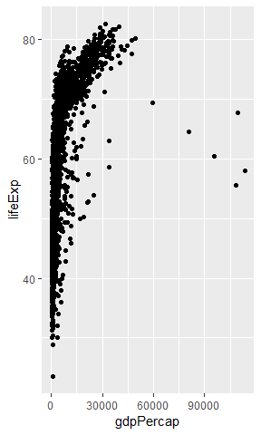

```
#git config --global user.name "Qing Zhou"
#git config --global user.email "qingzhou.cn@gmail.com"
#git config --global core.editor "vim"
#git init
```


*This is some formatting*
**Some other formatting**

[A hyperlink](https://google.com)

- A bulleted list
- Another list item

1. A numbered list
    1. A second numbered list


```
##  [1] "forcats"   "stringr"   "dplyr"     "purrr"     "readr"    
##  [6] "tidyr"     "tibble"    "tidyverse" "ggplot2"   "gapminder"
## [11] "stats"     "graphics"  "grDevices" "utils"     "datasets" 
## [16] "methods"   "base"
```

```
## # A tibble: 6 x 6
##   country     continent  year lifeExp      pop gdpPercap
##   <fct>       <fct>     <int>   <dbl>    <int>     <dbl>
## 1 Afghanistan Asia       1952    28.8  8425333      779.
## 2 Afghanistan Asia       1957    30.3  9240934      821.
## 3 Afghanistan Asia       1962    32.0 10267083      853.
## 4 Afghanistan Asia       1967    34.0 11537966      836.
## 5 Afghanistan Asia       1972    36.1 13079460      740.
## 6 Afghanistan Asia       1977    38.4 14880372      786.
```
<!-- -->


The largest population of any country in the Iceland is 81.757.

